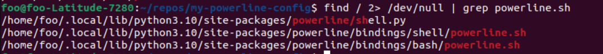

# Steps taken to install powerline

Following instructions from this youtube video: <https://www.youtube.com/watch?v=zfm2E4E7Dok>

#### 1. Check python installed

```bash
python3 --version
```

#### 2. Check pip3 installed

```bash
pip3
```

If pip3 not installed, run command as displayed in terminal, or:

```bash
sudo apt install python3-pip
```

#### 3. Install powerline

```bash
pip3 install --user powerline-status
```

#### 4. Install powerline git status plugin

```bash
pip3 install powerline-status
```

#### 5. Locate powerline-daemon directory (need to wait a while for command to finish running)

```bash
find / 2> /dev/null | grep powerline-daemon
```

Copy the line that ends in `/bin/powerline-daemon` and save it somewhere.


#### 6. Locate powerline.sh (takes similarly long as Step 5)

```bash
find / 2> /dev/null | grep powerline.sh
```



Copy the line that ends in `/bash/powerline.sh` and save it somewhere.

#### 7. Open .bashrc

```bash
code ~/.bashrc
```

#### 8. Scroll to bottom of .bashrc and paste the following

```bash
#Powerline
export PATH="PATH:/home/**YOUR_USER_NAME**/.local/bin/"
export LC_ALL=en_US.utf-8
powerline-daemon -q
POWERLINE_BASH_CONTINUATION=1
POWERLINE_BASH_SELECT=1
source /home/**YOUR_USER_NAME**/.local/lib/python3.10/site-packages/powerline/bindings/bash/powerline.sh
```

Remember to change all instances of `**YOUR_USER_NAME**` to your own system username!

#### 9. Make the following folders

```bash
mkdir -p ~/.config/powerline/colorschemes
mkdir -p ~/.config/powerline/themes/shell
```

#### 10. Copy original ```default.json``` config files into new folder

```bash
cp /home/**YOUR_USER_NAME**/.local/lib/python3.10/site-packages/powerline/config_files/colorschemes/default.json ~/.config/powerline/colorschemes
```

```bash
cp /home/**YOUR_USER_NAME**/.local/lib/python3.10/site-packages/powerline/config_files/themes/shell/default.json ~/.config/powerline/themes/shell
```

#### 11. Open colorscheme/default.json

```bash
code ~/.config/powerline/config_files/colorschemes/default.json
```

#### 12. Paste the following in "groups" for git customisation

```json
"gitstatus":                 { "fg": "gray8",           "bg": "gray2", "attrs": [] },
"gitstatus_branch":          { "fg": "gray8",           "bg": "gray2", "attrs": [] },
"gitstatus_branch_clean":    { "fg": "green",           "bg": "gray2", "attrs": [] },
"gitstatus_branch_dirty":    { "fg": "gray8",           "bg": "gray2", "attrs": [] },
"gitstatus_branch_detached": { "fg": "mediumpurple",    "bg": "gray2", "attrs": [] },
"gitstatus_tag":             { "fg": "darkcyan",        "bg": "gray2", "attrs": [] },
"gitstatus_behind":          { "fg": "gray10",          "bg": "gray2", "attrs": [] },
"gitstatus_ahead":           { "fg": "gray10",          "bg": "gray2", "attrs": [] },
"gitstatus_staged":          { "fg": "green",           "bg": "gray2", "attrs": [] },
"gitstatus_unmerged":        { "fg": "brightred",       "bg": "gray2", "attrs": [] },
"gitstatus_changed":         { "fg": "mediumorange",    "bg": "gray2", "attrs": [] },
"gitstatus_untracked":       { "fg": "brightestorange", "bg": "gray2", "attrs": [] },
"gitstatus_stashed":         { "fg": "darkblue",        "bg": "gray2", "attrs": [] },
"gitstatus:divider":         { "fg": "gray8",           "bg": "gray2", "attrs": [] }
```

#### 13. Paste the following in /themes/shell/default.json

```json
{
"function": "powerline_gitstatus.gitstatus",
"priority": 40
}
```


#### 14. Close and open terminal

Should see something like this:


Original instructions informed to perform 

```bash
source ~/.bashrc
```

but I met PATH problems. Opening and closing terminal launched powerline worked just fine for me.

#### 15. Download git fonts for powerline

```bash
git clone https://github.com/powerline/fonts.git --depth=1 powerline_fonts
```

#### 16. Run installation script in cloned powerline_fonts folder

```bash
./powerline_fonts/install.sh
```

Some fiddling around with the install.sh file might be required to get the installation path correct

More info: <https://askubuntu.com/questions/3697/how-do-i-install-fonts>

In the end I modified `install.sh` to install the fonts in `/home/**YOUR_USER_NAME**/.local/share/fonts`

#### 17. Change font in terminal settings


#### 18. Restart powerline-daemon to make git status appear

```bash
powerline-daemon --replace
```

#### 19. Done


#### 20. Fix gitstatus not showing correctly in VS Code

VS Code requires additional settings to make gitstatus appear. As it is, it will show a box in place of the branch symbol:


Change terminal font to one of the powerline fonts installed. Name can be referred to in terminal settings as in step 17.

Manually type in the font name incased in inverted commas. E.g.

```
'Droid Sans Mono Dotted For Powerline'
```


#### 21. Add time to prompt

Add the following to ```/.config/powerline/themes/shell```

```bash
{
    "segments": {
        "left": [
            {
                "function": "powerline.segments.common.time.date",
                "args": {
                    "istime": true,
                    "format": "%H:%M:%S"
                }
            },
			...
			]
			...
	}
```
Should look as follows:


Datetime formatting is based on python strftime method. More info:

<https://powerline.readthedocs.io/en/latest/configuration/segments/common.html#module-powerline.segments.common.time>

<https://unix.stackexchange.com/questions/228227/how-to-customize-a-segment-of-powerlinefor-bash-shell-ps1-layout-specifically>

<https://pynative.com/python-datetime-format-strftime/>

#### 22. Make prompt appear on new line

Reorganise ```/theme/shell/default.config``` to have following structure:

```json
{
"segments" : {
	"above":[{
		"left": [{...}],
		"right": [{...}]
	}],
	"left":[{...}],
	"right":[{...}]
	}
}
```

Modifications to make next line prompt:

```json
{
"segments" : {
	"above":[{
		"left": [
			{
				"function": "powerline.segments.common.time.date",
				"args": {
					"istime": true,
					"format": "%Y-%m-%d %H:%M:%S"
				},
				"priority": 40
			},
			{...}
			{
				"function": "powerline_gitstatus.gitstatus",
				"priority": 40
			}
		],
		"right": [{...}]
	}],
	"left":[
		{
			"type": "string",
			"contents": "$",
			"highlight_groups": ["continuation:current"]
		}
	],
	"right":[{...}]
	}
}
```

Should make the terminal look like this:

